# Medical Text Simplification

## Abstract
Medical texts can be difficult to understand for laymen, due to a
frequent occurrence of specialised medical terms. Replacing these
difficult terms with easier synonyms can, however, lead to improved
readability. In this report, we made a case study over two types of
approaches namely rule based methods, neural sequence to sequence
methods. The performance is evaluated by various metrics and observed
that neural sequence to sequence methods are better than rule based
methods. All the experiments were done on normal wikipedia and simple
wikipedia dataset. 

## Introduction

Our health, and the health of our family and friends, is something that
concerns us all. To be able to understand texts from the medical domain,
e.g. our own health record or texts discussing scientific findings
related to our own medical problems, is therefore highly relevant for
all of us. Therfore, there is a need for medical text simplification.

In this report rule based methods and neural sequence to sequence
methods. In rule based methods first we get the medical phrases from the
input sentence using medical entity recognizers then for the medical
phrases we get synonyms and replace with best one after ranking.
Metamap, Cliner, Ctakes are the three medical recognizers implemented.
For extracting synonyms we used UMLS, wordnet, Mesh. For ranking we used
number of google search results, google-ngrams api to get frequencies,
number of splits in a word. After finding the best synonym we replace
those medical phrases with the best synonym.

The task of medical text simplification can also be modeled as a seq to
seq problem very easily. The seq to seq models and procedures used in
neural machine translation can be used for text simplification as we can
consider simple text and normal text to be of two different languages so
that we can model the simplification task as a machine translation task
and can use a variety of methods and procedures that used for machine
translation to solve the task.

## Methods

The process of medical text simplification is broadly divided into two
types namely rule based methods, neural sequence-sequence methods. In
rule based method difficult medical terms are replaced with its easy
synonym. In Neural sequence to sequence methods, we train various types
of sequence to sequence models and predict by giving an input sentence.

### Rule based methods:

In this type of method we follow some rules in simplifying the given
input medical text. Flow diagram in Fig. \[fig:flow-diagram\] shows the
working of rule based methods, using medical entity recognizers, synonym
generators and ranking synonyms.
<figure>
  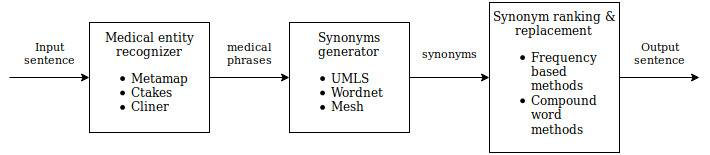
  <figcaption align = "center">Flow diagram for rule based methods</figcaption>
</figure>

#### Medical entity recognizers:

1.  **Metamap:**\
    MetaMap is a highly configurable program to map biomedical text to
    the UMLS Metathesaurus or, equivalently, to discover Metathesaurus
    concepts referred to in text. MetaMap uses a knowledge-intensive
    approach based on symbolic, natural-language processing (NLP) and
    computational-linguistic techniques. Besides being applied for both
    IR and data-mining applications, MetaMap is one of the foundations
    of NLM’s Medical Text Indexer (MTI) which is being used for both
    semiautomatic and fully automatic indexing of biomedical literature
    at NLM.

    We used a python wrapper pymetamap to get output from metamap. For a
    given sentence metamap detects the medical phrases along with its
    semantic type, score, preferred name, POS tag, etc. The output of
    metamap is like “ConceptMMI(index=’0’, mm=’MMI’, score=’9.94’,
    preferred\_name=’Cessation of life’, cui=’C0011065’,
    semtypes=’\[orgf\]’, trigger=’\[”DEATH“-tx-1-”death“-noun-0\]’,
    location=’TX’, pos\_info=’14/5’, tree\_codes=’C23.550.260’)”. There
    are about 133 semantic types in metamap. Among then we took only 20
    semantics for getting medical sentence. We considered the medical
    phrase for replacement only if its POS tag is ’noun’ and its
    semantic type is in 20 semantic types considered. We also consider
    the preferred name as one of the synonym for the medical phrase.
    Metamap is actually used to detect medical phrases fro a given
    medical sentence, but here we are using it for classification. The
    output of metamap is not too well for example it considered ’city’
    as a type clinical attribute, the score for this word is also
    reasonably high when compared to the score of the word ’disease’.
    Metamap detects the longest medical phrase possible, for example it
    considers “blood cancer” as a medical phrase instead of blood,
    cancer individually.

2.  **Ctakes:**\
    APACHE cTAKES is a software tool that processes Electronic Medical
    Record clinical free-text into more parseable/usable ontological
    representations via Natural Language Processing (NLP). It follows
    the standard NLP objective of extracting discrete atoms of
    information from free-text (an individual term, a relationship
    between different terms, what sort of information a given term
    represents, etc) that can then be taken and processed individually
    and/or in conjunction with other NLP atoms to derive meaning. This
    has many applications in the field of biomedical informatics, as
    information contained within free-text (as is common in clinical
    text) is unusable/undecipherable for software applications without
    further processing. In particular, one useful application of NLP
    would be to facilitate transition from paper records to EHR, as well
    as significantly aid in any form of clinical research that requires
    large scale analysis of clinical text.

    For a given input sentence Ctakes gives an output xml file. The xml
    file many tokens explaining the words, relations, id, begin and end
    positions. If thers is any medical phrase, then Ctakes assigns a
    UMLS concept to that phrase. We used Ctakes only for determining
    whether it is medical or not, for the classified medical sentence we
    got phrases from metamap as the output of Ctakes is difficult to
    read.

3.  **Cliner:**\
    Clinical Named Entity Recognition system (CliNER) is an open-source
    natural language processing system for named entity recognition in
    clinical text of electronic health records. CliNER system is
    designed to follow best practices in clinical concept extraction, as
    established in i2b2 2010 shared task. CliNER is implemented as a
    sequence classification task, where every token is predicted
    IOB-style as either: Problem, Test, Treatment, or None. Command line
    flags let you specify two different sequence classification
    algorithms namely CRF (default) - with linguistic and
    domain-specific features, LSTM.

    We used CRF based classification for cliner. For a give input
    sentence cliner gives the medical phrases along with the type of
    phrase namely Problem, Test, Treatment or None. We observed that
    cliner predicted medical phrases for a given medical sentence. The
    medical phrases from cliner are not good, for example the word
    “india” is determined as medical problem. It is also observed that
    same word “chenab” is determined as different medical semantic types
    “treatment”, “test”. Similar to metamap, it also detects the longest
    medical phrase.

#### Synonyms finder:

1.  **UMLS:**\
    The Unified Medical Language System (UMLS) is a collection of many
    controlled vocabularies in the biomedical sciences. It provides a
    mapping structure among these vocabularies and allows us to
    translate among the various terminologies. We use it as a
    comprehensive thesaurus and ontology of biomedical concepts that is
    a source of prospective synonyms for medical entities that are
    recognized. The thesaurus of UMLS is a super set of the Medical
    subject headings(MeSH) database that is a vocabulary thesaurus that
    is used for indexing articles for PubMed. To obtain synonyms of a
    concept we use the REST API provided by UMLS to obtain the headings
    of similar concepts that are used as synonyms.

2.  **Wordnet:**\
    WordNet is a large lexical database of English. Nouns, verbs,
    adjectives and adverbs are grouped into sets of cognitive synonyms
    (synsets), each expressing a distinct concept. Synsets are
    interlinked by means of conceptual-semantic and lexical relations.
    All the words in a synset can be considered to be synonyms. We use
    the wordnet database provided by NLTK python library to get the
    words in the sysnet of the word whoose synonnyms we wish to find.

3.  **MeSH:**\
    Medical Subject Headings (MeSH) is a comprehensive controlled
    vocabulary for the purpose of indexing journal articles and books in
    the life sciences; it serves as a thesaurus that facilitates
    searching and can be used a source of synonyms of medical terms.
    Created and updated by the United States National Library of
    Medicine (NLM), it is used by the MEDLINE/PubMed article database
    and by NLM’s catalog of book holdings. MeSH has been ignored as a
    source of synoyms as it specified to be a subse of the larger
    Thesaurus of UMLS.

#### Ranking of synonyms for replacement selection:

1.  **Frequency based methods:**\
    Frequency of occurance of a word can considered to signify the
    simplisity of the word as a word that is used more frequenty in
    literature is generaly more known by the speakers of the language. A
    word that is more widely used and is understood by more people can
    be considered to be a simpler word. Hence we can rank a word that is
    more frequently used in literature as a better replacemet in
    simplifying a sentence. We use two methods to get the frequency
    count of a word or phrase, the frequency of occurance of the phrase
    in the Google N grams dataset as it signifies the number of times a
    word has been used in literature across time in the English
    language. The second method is the count of number of search results
    for a google search for the phrase, this quantity gives a relative
    number of webpages that contain the phrase which inturn gives us the
    amount of usage of the word in the language. Ranking using frequency
    of occurance does not change for medical terms as the method is
    invariant of meaning of the word. There is a small but nontrivial
    difference between as there is a significant difference bettween the
    jargon used on the internet compared to the literature that is used
    in the ngrams dataset. We used the api provided by phrase finder to
    get the frequency occurance of a word in google ngrams.

2.  **Compound Word methods by Emil et al.:**\
    The number of subwords in a compound word in can be used to judge
    the simplicity of a word in some languages like swedish which is a
    componding language where a group of words in a phrase can be
    compounded to from a large compound word. We follow a stratagy where
    word with large number of subwords can be considerd to be simpler.
    This works incredibly well ranking medical terms as a more complex
    scientific word can be replaced with a large compound word with many
    subwords that signify the intent of the complex word that is easier
    to interpret. Although this work well for compunding lanuages it
    fails miserably with non compounding languages like english where
    there is lesser probability of compounding words and there is a hier
    probability of simpler synonyms being small with very few subwords.
    We use a python library compund word splitter to get the number of
    subword in a word to rank the synonyms.

### Neural sequence-sequence models:

Neural seq to seq models have been successfully used to model and solve
various basic problems in natural language processing like speech
processing, text processing, language translation, etc. The task of
medical text simplification can also be modeled as a seq to seq problem
very easily. The seq to seq models and procedures used in neural machine
translation can be used for text simplification as we can consider
simple text and normal text to be of two different languages so that we
can model the simplification task as a machine translation task and can
use a variety of methods and procedures that used for machine
translation to solve the task. We primarily concentrate on neural
machine translation models as they have shown significant promise in
modelling translation tasks. We compared three different models for the
task. The models used by Neural Text Simplification model by Sergiu
et.al, Seq-Seq model with Input feeding attention and a simple seq-seq
model with global attention.
<figure align="center">
  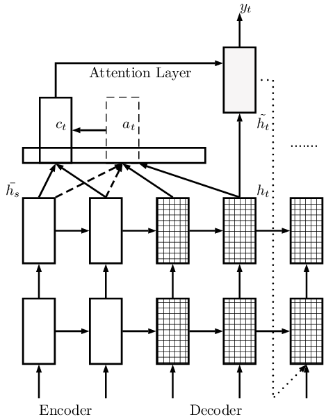
  <figcaption>Model of the neural simplification model with global attention and
input
feeding</figcaption>
</figure>

#### Neural Text Simplification model by Sergiu et al.:

We use a seq to seq encoder decoder model with global input feed
attention to model the simplification task. We use the OpenNMT framework
to train and build our architecture with two LSTM layers in an encoder
decoder format with hidden states of size 500 and 500 hidden units, and
a 0.3 dropout probability on the embedding space to prevent overfitting.
The vocabulary size is set to 50,000. For the decoder we employ global
attention in combination with input feeding as described by Luong et al.
(2015). The architecture is depicted in Fig. \[fig:globalatt\], with the
input feeding approach represented only for the last hidden state of the
decoder. For the attention layer, we compute a context vector$ c_t $by
using the information provided from the hidden states of the source
sentence and by computing a weighted average with the alignment weights
${a_t} $. The new hidden state is obtained using a concatenation of the
previous hidden state and the context vector:
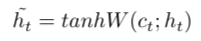

The global alignment weights at are
being computed with a softmax function over the general scoring method
for attention:
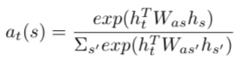

Input feeding is a process that sends the previous hidden state obtained
using the alignment method, to the input at the next step.

We test this model with weights obained by training the model on the
entire Normal Simple wikipedia dataset on a set on medical senteces
obtained by segregation using Ctakes. We also train the model from
scratch on 80,000 medical sentences and test it on medical sentences for
simplification.

#### Global Attention model without input feeding
<figure align="center">
  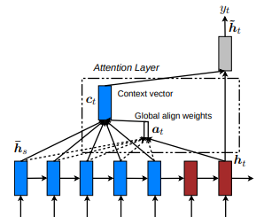
  <figcaption>Model of the neural simplification model with only global
attention</figcaption>
</figure>

To compare the performance of the the model proposed by Sergiu et al.
and the model trained only on medical sentences saperated using Ctakes
we require a baseline neural seq to seq model. We choose the default Seq
2 Seq model provided by OpenNMT library as a baseline. The global
attention model is similar to the above model but where it differs is in
the feedback mechanism where it lacks the feedback where $\Tilde{h_{t}}$
vector is concatenated with the input of the decoder at the next time
step.

## Evaluation Metrics:
1.  **BLEU score:**\
    BLEU (bilingual evaluation understudy) is an algorithm for
    evaluating the quality of text which has been machine-translated
    from one natural language to another. Quality is considered to be
    the correspondence between a machine’s output and that of a human:
    “the closer a machine translation is to a professional human
    translation, the better it is” – this is the central idea behind
    BLEU. BLEU was one of the first metrics to claim a high correlation
    with human judgements of quality, and remains one of the most
    popular automated and inexpensive metrics.\
    NLTK provides the sentence\_bleu() function for evaluating a
    candidate sentence against one or more reference sentences. The
    reference sentences must be provided as a list of sentences where
    each reference is a list of tokens. The candidate sentence is
    provided as a list of tokens.

2.  **ROUGE\_L:**\
    ROUGE\_L works by comparing an automatically produced summary or
    translation against a set of reference summaries (typically
    human-produced). ROUGE gives three values - precision, recall and
    f-measure(harmonic mean of precision and recall).

    ROUGE-n recall=40% means that 40% of the n-grams in the reference
    summary are also present in the generated summary. ROUGE-n
    precision=40% means that 40% of the n-grams in the generated summary
    are also present in the reference summary. ROUGE-n F1-score=40% is
    more difficult to interpret, like any F1-score. ROUGE-1 refers to
    overlap of unigrams between the system summary and reference
    summary. ROUGE-2 refers to the overlap of bigrams between the system
    and reference summaries. ROUGE-L – measures longest matching
    sequence of words using LCS. An advantage of using LCS is that it
    does not require consecutive matches but in-sequence matches that
    reflect sentence level word order. Since it automatically includes
    longest in-sequence common n-grams, you don’t need a predefined
    n-gram length.

3.  **SkipThoughtSim:**\
    SkipThought Similarity is a metric used to check the difference in
    the meaning of two sentences, It wrks by generating a fixed length
    vector representation of each sentence and then computing the
    euclidean distance between the two vectors to get a scalar that
    signifies the differnece in the meaning of the sentences. The skip
    thought vectors are generated using the encoder in a seq2seq model
    with two decoders trained to predict the prior and posterior
    sentence of a particular sentence in a corpus.

4.  **Flesch kincaid score (Readability):**\
    The score on the test will tell you roughly what level of education
    someone will need to be able to easily read a piece of text. The
    Reading Ease formula generates a score between 1 and 100. Although,
    it is possible to generate scores below and above this banding. A
    conversion table is then used to interpret this score. For example,
    a score of 70-80 is equivalent to school grade level 7. It should be
    fairly easy for the average adult to read. The formulas are based on
    two factors:

    1\. sentence length as judged by the average number of words in a
    sentence.

    2\. word length as judged by the average number of syllables in a word.

    The rationale here is straightforward. Sentences that contain a lot
    of words are more difficult to follow than shorter sentences. Just
    read James Joyce’s Ulysses if you don’t believe me.Similarly, words
    that contain a lot of syllables are harder to read than words that
    use fewer syllables.For example, ‘it was a lackadaisical attempt’ is
    more difficult to read than ‘it was a lazy attempt’.

5.  **Simple or Difficult Text Classifier**\
    To assess the difficulty of the generated sentences we built a
    classifier that classifies a sentence into simple or complex, we
    train the model on the word2vec representations of the sentences in
    the simple,complex aligned wikipedia corpus with a class 1 assigened
    to Difficult sentenes and a class 0 assigned to simple sentences.
    When given a new sentence the value between 0,1 that is returend by
    the classifeier would signify the difficulty of the sentence. We
    soon realized that building a classifier to classify senctences with
    their word to vec representations is a difficult task as they are
    fairly evenly distributed and could not be saperated we obtained an
    accuracy of 0.52 on a balanced dataset that is almost as good as
    random predictions, one of the reasons for this to happen maybe that
    the word2vec representation of a sentences captures the meaning of
    the sentences rather than the type of the word used, as the meaning
    of a sentence doesnot change when it is simplified it is difficult
    to classify a sentence from a word to vec representation.

## Observations and Results:

#### NOTE:

To test the methods used we used 185 sentences for metamap 115 sentences
for cliner 85 sentences for ctakes. we could only manage the following
number due to the speed limitaion enforced by the UMLS metathesaurus. On
an average each request to the UMLS metathesaurs takes about a minute.
In all the combinations of methods used UMLS is used 3 times hence a
sentence takes about 3min for all the variations of UMLS to work. Doing
this for a large enoough corpus is exteremely time intensive and time is
precious.

We didnot use MeSH as a source of synonyms as the UMLS metathesaurus is
a super set of the MeSH thesaurus.

We did not include the results for the frequencies obtained from the
google search as we did not try attempting it due to ethical reasons as
the chances of google blocking the requests from the college are every
high in context to the events that happend with arxiv.org in the past
few months due to the high number of request that would be sent for
ranking the synonyms.
<figure align="center">
  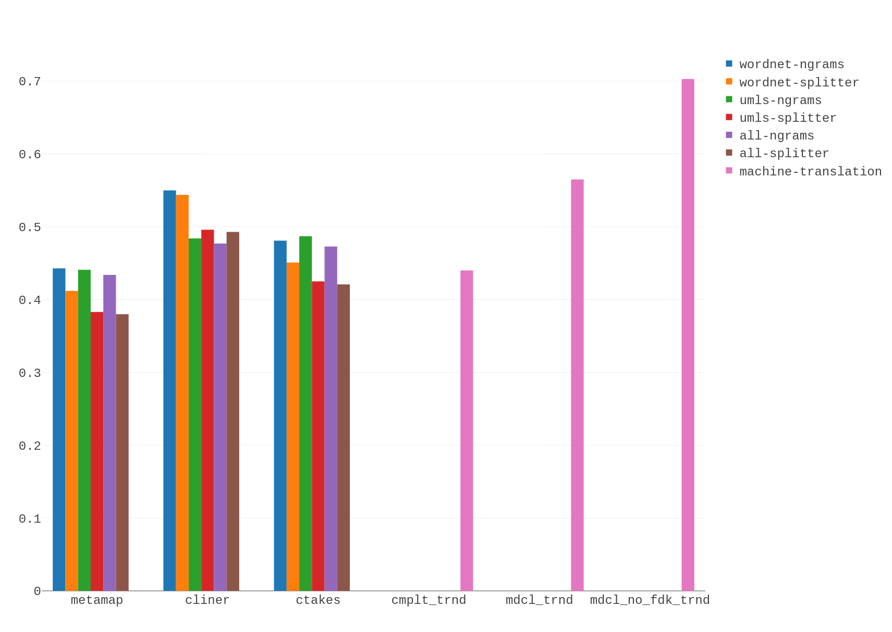
  <figcaption>BLEU score</figcaption>
</figure>

<figure align="center">
  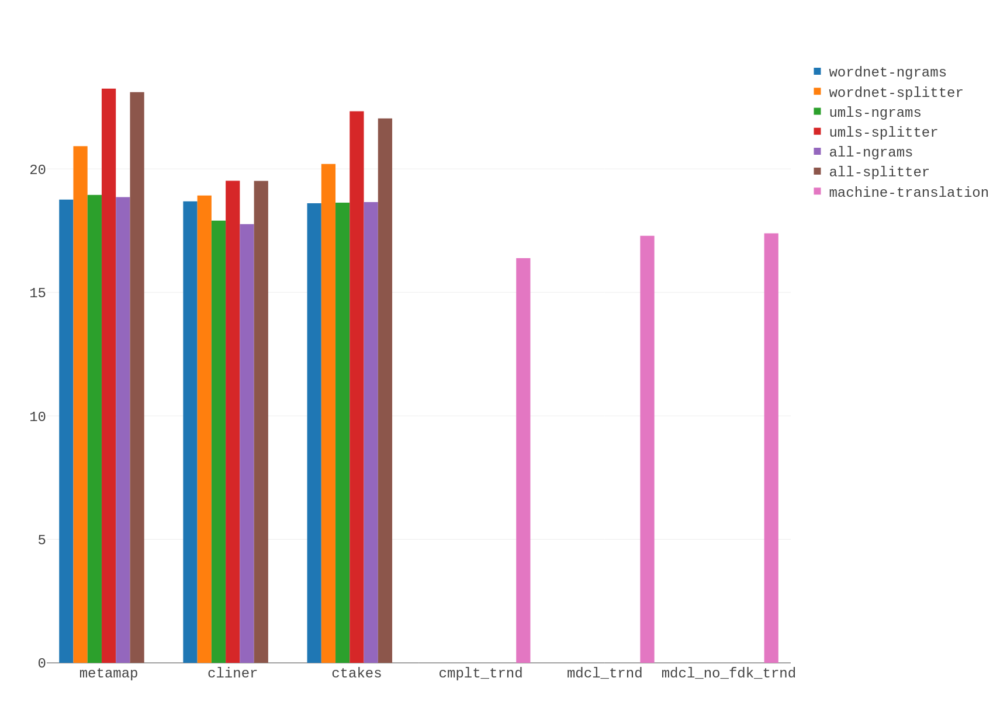
  <figcaption>Flesch kincaid score
(Readability)</figcaption>
</figure>

<figure align="center">
  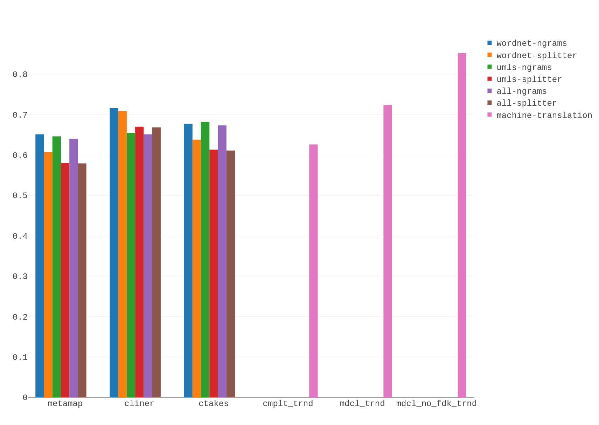
  <figcaption>ROUGE\_L(f1-score)</figcaption>
</figure>

<figure align="center">
  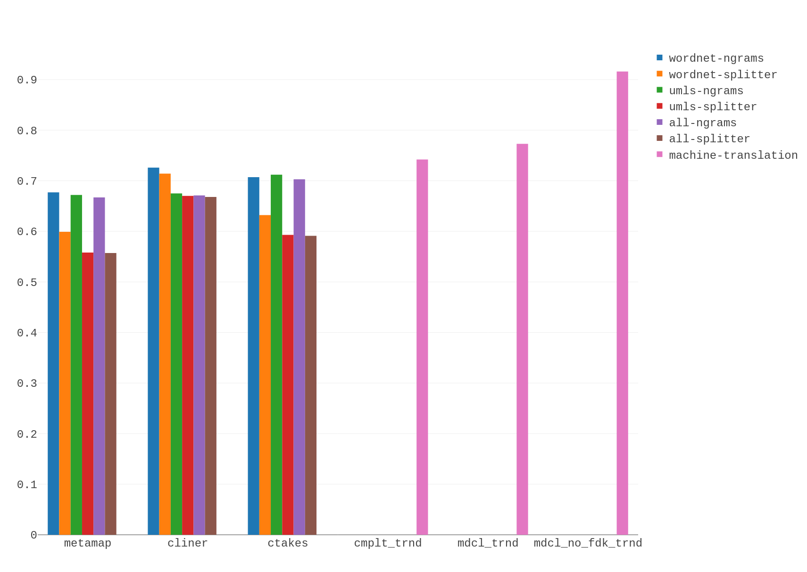
  <figcaption>ROUGE\_L(precision)</figcaption>
</figure>

<figure align="center">
  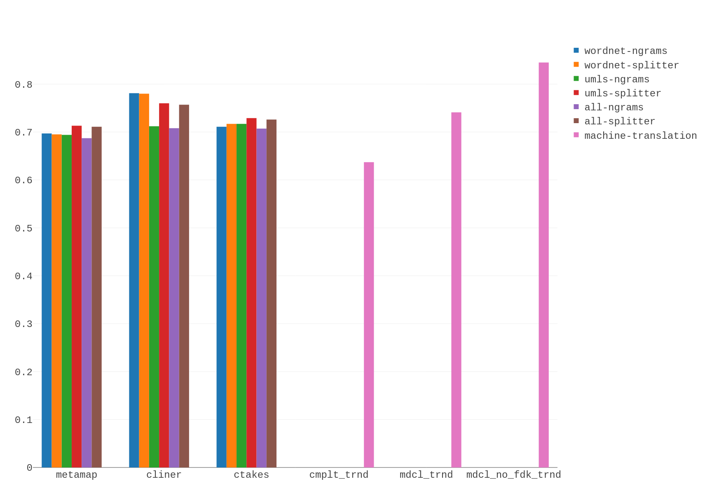
  <figcaption>ROUGE\_L(recall</figcaption>
</figure>

<figure align="center">
  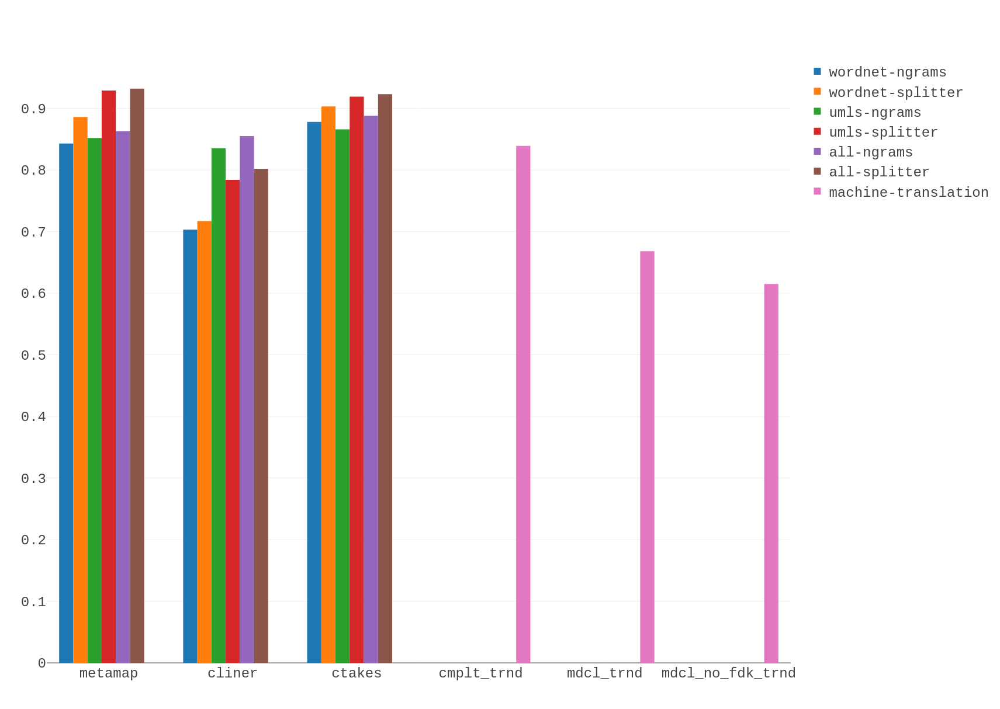
  <figcaption> Euclidean distance on vectors from skipthoughtsim</figcaption>
</figure>
<figure align="center">
  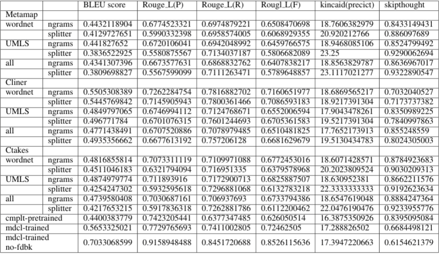
  <figcaption></figcaption>
</figure>

